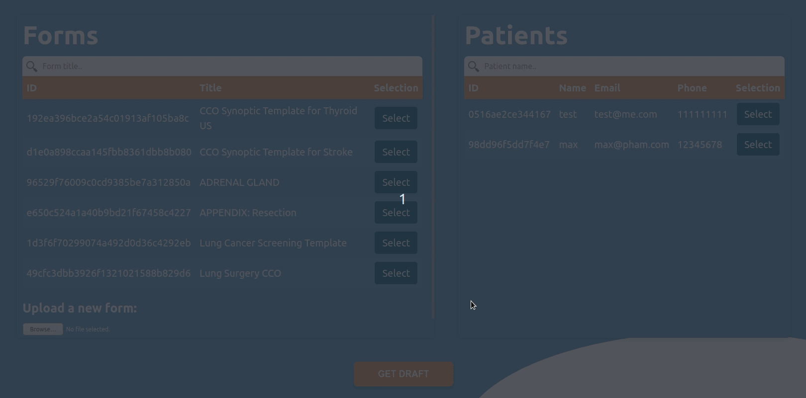
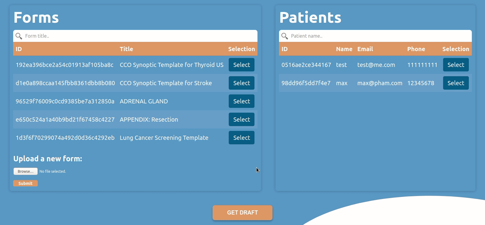
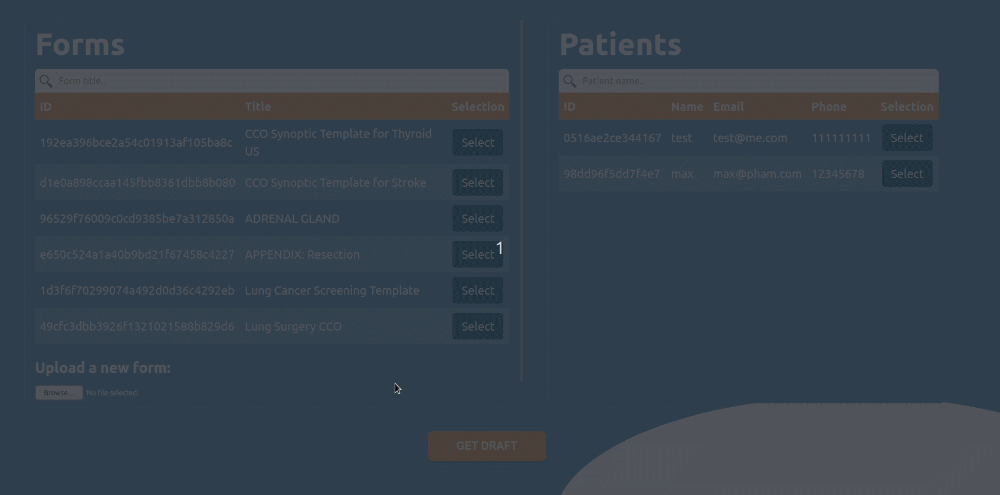
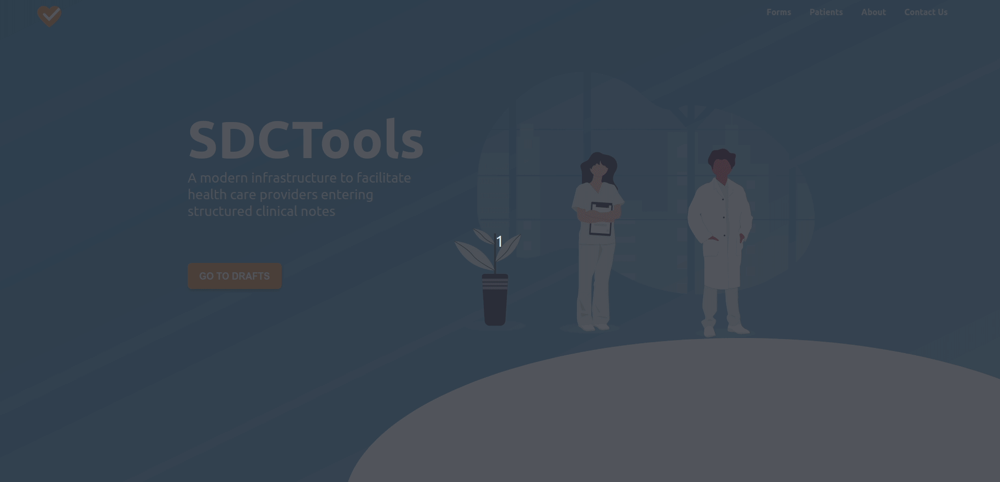

<p align="center">

<br/>
<br/>
<strong>SDCTools</strong> is a react-enabled app to assist and reinforce accuracy and correctness for practitioners to record patient data through an easy-to-use and intuitive process. The application serves as a middleman to redesign "pen and paper" structure of the SDC form for versatility and minimization of human errors. We utilize and redesigned information from SDC standards that medical practitioners often refer to when they start their diagnosis, and syndicate this information in a way that is <strong>mobile</strong>, <strong>flexible</strong> and <strong>modern</strong>.
</p>


- [Documents](#documents)
- [Contributing Guide](#contributing-guide)
- [Instructions](#instructions)
  - [Getting Started](#getting-started)
    - [Form Not Found](#form-not-found)
  - [Filling out data](#filling-out-data)
  - [Getting saved draft](#getting-saved-draft)
- [Motivation](#motivation)

## Documents

[P2.Technical_Report](./docs/phase2/product.md)

## Contributing Guide

[Express Routes](docs/routes.md)

1. Run `npm install` in both [frontend/](/frontend/) and [backend/](/backend/) folders.
2. Then simultaneously buidling and starting the frontend and backend development servers by running:

```bash
npm run dev
```

## Instructions

Start by following the instructions in the [Contributing Guide](#Contributing_Guide) section above to install dependencies and run the application development server. When you load up the app in your browser, you should see the application Home screen.

### Getting Started

As a form filler, you have the ability to choose the form and patient to conduct your diagnosis:


From there you can select the form and patient you need.



#### Form Not Found

In the case of not finding the form that you require, you can directly upload the SDC form in XML type to be saved in database to be used instantly and available for everyone else.



### Filling out data

Once you selected your form and the patient in question, you can create a new draft to be filled out. After completing the form, you can save it for future references. And that particular form will be associated with 1 patient.



### Getting saved draft 

To access a previously saved form, we can simply go to the patient's profile and search for their related forms.



## Motivation
